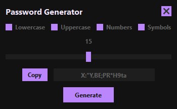

# `Password Generator PyQT6 App`

<p align="center">
    
    
    
    <a href="https://github.com/javierperez98"></a>
</p>
<p align="center">
    
    
    
    
</p>

## `Description`

<!-- Provide a short description explaining the what, why, and how of your project.
What was your motivation? Why did you build this project? What problem does it solve? What did you learn? -->

- My Password Generator app was created using Python 3 and PyQT 6. I really enjoyed creating this to practice more and learn how to create a desktop app using PyQT6. It was a bit of trail and error to get PyQT6 installed and working but diving more into the documentation I was able to get it up and running.

## `Table of Contents`

- [Installation](#installation)
- [Usage](#usage)
- [Credits](#credits)
- [License](#license)
- [Questions](#questions)

## `Installation`

<!-- What are the steps required to install your project? Provide a step-by-step description of how to get the development environment running. -->

To install copy and paste either the SSH or HTTPS key and run it in either Bash (PC Users) or Terminal (MAC Users) using the git clone command.

- SSH key:

```md
git clone git@github.com:javierperez98/passwordGenApp.git
```

- HTTPS key:

```md
git clone https://github.com/javierperez98/passwordGenApp.git
```

Next make sure you have Python 3.6 or greater, Pip and Pyinstaller installed to build the app. If you have that open the Terminal and run the command below.

```md
pyinstaller.exe --onefile --windowed --icon=passGen.ico passGen.py
```

After the build is done you will see a dist folder with the app exe which is the fully packaged app. Double click the exe to open the app.

## `Usage`

<!-- Provide instructions and examples for use. Include screenshots as needed. -->

- The app will open in the bottom right of your screen.
- There will be a close button on the top right to close the app.
- There is four checkboxs to select what characters you would like to include in the password.
- A slider to set the password length.
- The output textbox with a copy button that will copy the generated password to your clipboard.
- Then the generate button that will create your password.

  

## `Credits`

<!-- List your collaborators, if any, with links to their GitHub profiles. Links to websites or resources. -->

- https://www.google.com
- https://www.python.org/
- https://pypi.org/project/pip/
- https://doc.qt.io/
- https://stackoverflow.com/

## `License`

<!-- If you need help choosing a license, refer to https://choosealicense.com/ -->

MIT License

Copyright (c) 2021 [Javier Perez]

Permission is hereby granted, free of charge, to any person obtaining a copy
of this software and associated documentation files (the "Software"), to deal
in the Software without restriction, including without limitation the rights
to use, copy, modify, merge, publish, distribute, sublicense, and/or sell
copies of the Software, and to permit persons to whom the Software is
furnished to do so, subject to the following conditions:

The above copyright notice and this permission notice shall be included in all
copies or substantial portions of the Software.

THE SOFTWARE IS PROVIDED "AS IS", WITHOUT WARRANTY OF ANY KIND, EXPRESS OR
IMPLIED, INCLUDING BUT NOT LIMITED TO THE WARRANTIES OF MERCHANTABILITY,
FITNESS FOR A PARTICULAR PURPOSE AND NONINFRINGEMENT. IN NO EVENT SHALL THE
AUTHORS OR COPYRIGHT HOLDERS BE LIABLE FOR ANY CLAIM, DAMAGES OR OTHER
LIABILITY, WHETHER IN AN ACTION OF CONTRACT, TORT OR OTHERWISE, ARISING FROM,
OUT OF OR IN CONNECTION WITH THE SOFTWARE OR THE USE OR OTHER DEALINGS IN THE
SOFTWARE.

## `Questions`

Contact me for any questions you might have.

- GitHub: [javierperez98](https://github.com/javierperez98)
- Email: [javier21perez98@gmail.com](mailto:javier21perez98@gmail.com)
- LinkedIn: [javierperez98](https://www.linkedin.com/in/javier-perez98/)
